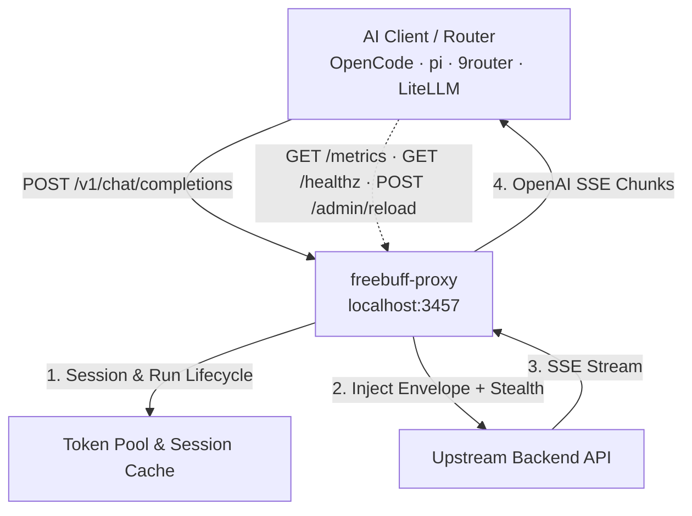

# freebuff-proxy: No ads, no CLI, just /v1/chat/completions

[](https://github.com/trefeon/freebuff-proxy/actions/workflows/ci.yml)
[](https://github.com/trefeon/freebuff-proxy/releases)
[](https://github.com/trefeon/freebuff-proxy/blob/main/LICENSE)

`freebuff-proxy` is a local gateway that makes the AI coding models behind Codebuff/FreeBuff available to **any** tool that speaks the OpenAI API: OpenCode, pi, 9router, LiteLLM, or your own scripts.

Your coding tools expect an OpenAI-style endpoint (`/v1/chat/completions`). The upstream service is not OpenAI-shaped: it is a CLI coding agent with its own session protocol, and its free-tier access is tied to per-account tokens that carry individual daily quotas and can be rate-limited or banned. `freebuff-proxy` sits between the two and absorbs that friction:

- **Translates**: rewrites standard OpenAI requests into the upstream session protocol (CLI request envelope, model-bound agent runs, tool-schema normalization) and streams the SSE response back as OpenAI `chat.completion.chunk` events.
- **Pools**: routes requests across multiple tokens (hot-session-first with round-robin start and failover), so a busy client or router rides out per-account quotas instead of failing.
- **Stealths**: makes egress look like a real browser (TLS fingerprints, header sanitization, request jitter) so upstream abuse detection is less likely to flag your account (see the ToS warning below).

> **⚠️ Terms-of-service risk.** Using your FreeBuff token through this proxy conflicts with FreeBuff/Codebuff terms of service; upstream abuse detection can suspend or permanently ban accounts. Use `SAFE_MODE=true`, keep usage modest, and do not run unattended 24/7. See [Getting Started](docs/guides/getting-started.md).

---

## Table of Contents

- [New here? Start here](#new-here-start-here)
- [Requirements](#requirements)
- [Features](#features)
- [How It Works](#how-it-works)
- [Key Concepts](#key-concepts)
- [Quick Start](#quick-start)
- [Command-Line Interface](#command-line-interface)
- [Configuration Reference](#configuration-reference)
- [Deployment](#deployment)
- [Guides](#guides)
- [Contributing & Security](#contributing--security)
- [Contact & Support](#contact--support)
- [License](#license)

---

## New here? Start here

Freebuff-proxy makes the free AI models behind the FreeBuff/Codebuff CLI available to any OpenAI-compatible tool (OpenCode, pi, 9router, LiteLLM). If you are new:

1. **Get a FreeBuff account + token.** You need a Codebuff/FreeBuff account; the token (`cb_...`) is what the proxy uses upstream. Get one with the official CLI or `scripts/gen-token.*`. See [Obtain an Auth Token](#2-obtain-an-auth-token).
2. **Install the proxy.** One command, no Go or Docker required. See [Quick Start](#quick-start).
3. **Connect your AI tool.** Point OpenCode, pi, 9router, or LiteLLM at `http://127.0.0.1:3457/v1`. See [Client Integration](docs/guides/client-integration.md).

For a guided walkthrough, read [Getting Started](docs/guides/getting-started.md) (5 minutes).

## Requirements

| Requirement | Details |
|---|---|
| **A FreeBuff/Codebuff account** | Free account at codebuff.com / freebuff.com. The proxy relays your account's token; each account has its own daily session quota. |
| **A token (`cb_...`)** | From the official CLI login or `scripts/gen-token.*`. See [Obtain an Auth Token](#2-obtain-an-auth-token). |
| **OS** | Linux, macOS, or Windows (amd64/arm64). Prebuilt release binaries; no Go toolchain needed. |
| **Docker** | Optional: only for the container deployment path (`docker compose up -d --build`). |
| **Network** | Outbound HTTPS to `codebuff.com` (configurable via `UPSTREAM_BASE_URL`); the proxy listens on loopback `127.0.0.1:3457` by default. |
| **Go 1.26+** | Only if building from source. |

---

## Features

- **OpenAI-Compatible API**: `POST /v1/chat/completions` (stream + non-stream), `GET /v1/models`, `GET /healthz`, Prometheus `GET /metrics`, and hot config reload via `POST /admin/reload`.
- **Admin Dashboard**: embedded single-binary web UI at `http://<host>:3457/admin`: live overview with a one-click smoke test (a real chat through the pool), runtime token management (add/remove/test on the live pool, persisted to `.env`, no restart), a pooled↔bridge mode switch, a three-step setup wizard with full diagnostics, a `.env` config editor with validation and hot-reload, a log viewer, and metrics sparklines. Login via `ADMIN_TOKEN`; htmx-driven, zero build step.
- **Dynamic Reasoning Effort**: OpenAI `reasoning_effort` (`low`/`medium`/`high`/`max`) and Codex/Anthropic `reasoning.effort` are normalized and mapped to upstream reasoning engines.
- **Session & Run Lifecycle**: Upstream session handshakes, model-lock recovery (`DELETE` → re-`POST`), grace draining, and idle-run finishing, all automatic.
- **Token Pooling & Bridge Mode**: Hot-session-first pooling with round-robin start and failover across `AUTH_TOKENS`, or zero-storage relay when clients bring their own token. See [Key Concepts](#key-concepts).
- **Token Auto-Discovery**: With empty `AUTH_TOKENS`, credentials are read from the official CLI login files (`~/.config/manicode/credentials.json`, `~/.config/codebuff/credentials.json`). Disable with `AUTO_DISCOVER_TOKEN=false`.
- **TLS Stealth & Egress Proxies**: `HTTP_PROXY` / `SOCKS5_PROXY`, per-token SOCKS5 routing (`SOCKS5_PROXIES`, bound by token index), and browser TLS fingerprinting via uTLS (Chrome, Firefox, Safari, Edge).
- **Subagent-Ready Concurrency**: Single-flight session refresh prevents race conditions during high-volume tool-calling loops.
- **Safe Mode**: On by default: anti-ban presets (TLS stealth, header sanitization, jitter, idle rotation).
- **Operational Tooling**: `-doctor` diagnostics with a real session-handshake validity probe per token, `-test-token` (exit 0/1 for installers and scripts), `-setup` interactive client configuration, and a SHA-256-verified `-update` self-updater.
- **Quota Transparency**: Live per-model quota (from the upstream `rateLimitsByModel` admission payload) is surfaced in `GET /healthz` (per-token `quota` map) and `GET /metrics` (`freebuff_proxy_quota_recent` / `freebuff_proxy_quota_limit` gauges).

## How It Works

One chat request, end to end:

1. **Your tool calls the proxy.** It POSTs a standard OpenAI request to `http://127.0.0.1:3457/v1/chat/completions`, same shape it would send to any OpenAI-compatible endpoint.
2. **A token is chosen.** The proxy prefers the token that already holds a live session (hot-session-first), starting from a round-robin index and skipping tokens in cooldown or locked by a rate limit; in bridge mode it uses the token your client sent in its `Authorization` header.
3. **The request is translated.** The model id is resolved through the catalog to the upstream agent that runs it, the message list is sanitized and re-wrapped in the CLI request envelope, and OpenAI extras (`reasoning_effort`, tool schemas, etc.) are mapped to what upstream expects.
4. **It goes out stealthily.** The upstream call uses a browser-like TLS handshake and sanitized headers, through `HTTP_PROXY` / `SOCKS5_PROXY` if configured.
5. **The stream comes back translated.** The upstream SSE stream is converted into OpenAI `chat.completion.chunk` events and relayed to your client in real time.
6. **State is cleaned up.** When the request finishes, the run is drained; once a run or token ages out (rotation interval, idle timeout), it is rotated or finished so the next request starts clean. A token that hit a quota limit (`429`) is locked locally until its reset time. The proxy answers `429` + `Retry-After` itself, with no traffic sent upstream.

The translation layer reimplements the official CLI's wire protocol and session lifecycle, sourced from the open-source Freebuff client (Apache-2.0). It changes when the upstream changes. The translation lives in `internal/convert`, `internal/upstream`, `internal/stealth`, and `internal/registry`.



## Key Concepts

| Concept | What it means |
|---|---|
| **Token** | One FreeBuff/Codebuff account credential (`cb_...`). Each token has its own daily quota and can be rate-limited or banned independently. |
| **Session** | Per-token upstream admission state (handshake, model locks). The proxy maintains and reuses it so every request does not pay the handshake cost. |
| **Run** | One upstream agent execution for a model, shared across many requests. Runs start on first use, live for `ROTATION_INTERVAL` (default `6h`), then are rotated (fresh start, old one drained/finished) so no run accumulates suspiciously long-lived activity. Idle tokens get their runs finished too. |
| **Model** | A catalog entry addressed as `provider/model` (e.g. `deepseek/deepseek-v4-flash`). The registry serves `/v1/models` and maps each model to the upstream agent that runs it. |
| **Pooled mode** | You configure several tokens in `AUTH_TOKENS`. Requests stick to the token with a live session and fail over only when it is rate-limited or errors: a reactive drain, not aggressive rotation. Best for one user with several accounts who wants maximum uptime and quota headroom. |
| **Bridge mode** | You configure no tokens. Each client sends its own token as `Authorization: Bearer <token>`, and the proxy relays with it, caching per-client state (LRU, max 32). Best for a shared router (e.g. 9router) serving many users who each bring their own account. |
| **Hybrid mode** | You configure `HYBRID_MODE=true` with tokens in `AUTH_TOKENS`. Clients that send a `Bearer` token get bridge-style per-client relay; token-less requests are served from the pool. Best when some clients bring their own account while your own tooling uses the pool. |
| **Safe mode** | Default-on anti-ban presets: TLS stealth, proxy-header sanitization, request jitter, and idle rotation. See [Safe Mode](#safe-mode--zero-spam-quota-handling). |
| **Quota lock** | When a token hits its daily limit, the proxy parses the upstream `429` reset timestamp and refuses local requests for that token until reset, fast (`<1ms`), silent, and spam-free. |

---

## Quick Start

### 1. Install

**One-command installer (Linux/macOS):**

```bash
curl -sSL https://raw.githubusercontent.com/trefeon/freebuff-proxy/main/scripts/install-freebuff-proxy.sh | bash
```

**Windows (PowerShell):**

```powershell
irm https://raw.githubusercontent.com/trefeon/freebuff-proxy/main/scripts/install-freebuff-proxy.ps1 | iex
```

The bash installer prompts for an install method (easy, manual binary, Docker Compose, bridge mode); both installers mint/read your token and write `.env`.

**Alternatively**, run with Docker Compose:

```bash
cp .env.example .env   # then set AUTH_TOKENS
docker compose up -d --build
```

**Or** download a release binary from [Releases](https://github.com/trefeon/freebuff-proxy/releases) (Linux/macOS/Windows × amd64/arm64) and run `./freebuff-proxy`.

### 2. Obtain an Auth Token

Generate one headlessly (opens a browser OAuth login, prints the token to the terminal without saving):

**Windows (PowerShell):**

```powershell
.\scripts\gen-token.ps1 -ToClipboard
```

**Linux / macOS (bash):**

```bash
./scripts/gen-token.sh --clipboard
```

`gen-token.*` are aliases for `gen-freebuff-token.*`, which also supports `--save` (store in the CLI credentials file), `--append` (add to `.env` `AUTH_TOKENS`), and `--env <path>`.

Alternatively, log in with the official CLI (`npm i -g freebuff && freebuff`): the proxy auto-discovers the token from its credentials file on startup.

### 3. Configure

Copy the example and set your token:

```bash
cp .env.example .env
# AUTH_TOKENS=cb_xxx        ← paste your token (comma-separate for pooling)
# SAFE_MODE=true            ← default (set false to disable)
```

Leave `AUTH_TOKENS=` empty for **bridge mode** (clients bring their own tokens). Not sure which to pick? One user with a few accounts → pooled mode; a shared router serving many users → bridge mode. See [Key Concepts](#key-concepts). `config.example.json` shows the equivalent JSON config file, loaded with `-config`; see the [Configuration Reference](#configuration-reference) for every key.

### 4. Run & Verify

```bash
./freebuff-proxy            # or: docker compose up -d
```

Check health and run diagnostics:

```bash
curl http://127.0.0.1:3457/healthz
./freebuff-proxy -doctor       # config, port, DNS/TLS, registry + per-token session probes
./freebuff-proxy -test-token   # real session handshake on the first token; exit 0/1
```

---

## Command-Line Interface

| Flag | Description |
|---|---|
| *(none)* | Run the proxy |
| `-config <path>` | Load an optional JSON config file (keys mirror env names) |
| `-v` | Verbose (debug) logging |
| `-version` | Print version and exit |
| `-doctor` | Run configuration and environment diagnostics: config, port, DNS/TLS reachability, model registry, and a real session-handshake validity probe per token |
| `-test-token` | Probe the first configured token with a real upstream session handshake; prints `token OK` and exits `0`, or exits `1` (for installers/scripts) |
| `-update` | Self-update from the latest GitHub release (SHA-256 verified against `checksums.txt`) |
| `-setup` | Interactive client setup (detects installed clients) |
| `-yes` | Auto-confirm `-setup` prompts |

---

## Configuration Reference

All keys can be set via environment variables or the JSON config file passed to `-config` (`AUTO_DISCOVER_TOKEN` is environment-only); a local `.env` file (if present) is also read, and for the keys it covers it behaves like the environment. Precedence, lowest to highest: **built-in defaults < JSON `-config` < `./.env` < environment**. List values (`AUTH_TOKENS`, `API_KEYS`, `SOCKS5_PROXIES`) are comma-separated in env and arrays in JSON.

| Environment Variable | Default | Description |
|---|---|---|
| `LISTEN_ADDR` | `127.0.0.1:3457` | Host and port to bind (loopback; containers set `:3457`) |
| `UPSTREAM_BASE_URL` | `https://codebuff.com` | Upstream API endpoint (normalized to `www.codebuff.com`) |
| `AUTH_TOKENS` | `""` | Comma-separated upstream tokens (empty = bridge mode) |
| `HYBRID_MODE` | `false` | Run the pooled pool and bridge relay in one process: a client `Authorization: Bearer` token is relayed like bridge, token-less requests fall back to `AUTH_TOKENS` (pooled requests still require an `API_KEYS` match when `API_KEYS` is set) |
| `MODELS_HIDE_UNAVAILABLE` | `false` | `/v1/models` prunes models marked unavailable (region/tier demotion, quota exhaustion) so picker clients cannot select them; off by default so a stale signal never hides a working model |
| `AUTO_DISCOVER_TOKEN` | `true` | When `AUTH_TOKENS` is empty, read credentials from the official CLI login files (`false` disables) |
| `API_KEYS` | `""` | Comma-separated client keys required for `/v1/*` (empty = open; ignored in bridge mode) |
| `ADMIN_TOKEN` | `""` | Bearer token that `POST /admin/reload` requires when set (empty = unauthenticated in default deployments; a startup warning is logged). Also the login password for the [admin dashboard](#admin-dashboard): the same value unlocks the login page |
| `ROTATION_INTERVAL` | `6h` | Agent-run rotation interval |
| `REQUEST_TIMEOUT` | `15m` | Upstream request timeout |
| `SESSION_CALL_TIMEOUT` | `30s` | Session call timeout |
| `REGISTRY_REFRESH` | `6h` | Model catalog refresh interval |
| `COST_MODE` | `free` | `free` (free-tier) or paid billing mode |
| `TLS_FINGERPRINT` | `auto` | `auto`, `chrome120`, `chrome126`, `safari17`, `safari18`, `firefox120`, `firefox128`, `edge126`, `random` |
| `HTTP_PROXY` | `""` | Outbound HTTP proxy for upstream requests |
| `SOCKS5_PROXY` | `""` | Outbound SOCKS5 proxy for upstream requests |
| `SOCKS5_PROXIES` | `""` | Per-token SOCKS5 proxies (comma-separated) |
| `PROXY_ROTATION` | `per-token` | SOCKS5 binding mode: `per-token` (bind by token index), `round-robin`, or `random` per request |
| `DEBUG_DUMP` | `false` | Persist redacted traffic dumps to `./dump/` (mode 0600) |
| `LOG_FILE` | `""` | Append log lines to a file (e.g. `./logs/proxy.log`) |
| `LOG_LEVEL` | `info` | `debug`, `info`, `warn`, `error` |
| `MAX_MESSAGES_PER_DAY` | `0` | Per-token daily cap on successful chats (`0` = unlimited, default; the upstream `429` lock is the real enforcement) |
| `IDLE_ROTATION_TIMEOUT` | `0` | Finish runs after this idle period (`0` = disabled; `SAFE_MODE` sets 30m when unset) |
| `SAFE_MODE` | `true` | Apply anti-ban presets (see below; set `false` to disable) |
| `REQUEST_JITTER` | `0s` | Random delay range `[0, REQUEST_JITTER)` before upstream calls (`SAFE_MODE` sets 2s when unset) |
| `CLI_VERSION` | `0.10.7` | Upstream CLI version string used in the request envelope |
| `MODEL_ALIASES` | `""` | Map aliases to real model IDs, e.g. `gpt-4o:deepseek/deepseek-v4-flash` |
| `TRANSIENT_RETRIES` | `1` | Max additional attempts after a transient transport failure; `0` disables |
| `SESSION_PERSIST` | `false` | Persist session state to disk so a restart resumes an unexpired session instead of burning a new daily slot |
| `SESSION_STATE_FILE` | `.freebuff-session-state.json` | Path of the session state file (used when `SESSION_PERSIST=true`; token-keyed, `0600`) |

### Safe Mode & Zero-Spam Quota Handling

`SAFE_MODE=true` is the **default** for all setups (set `SAFE_MODE=false` to
opt out). It enables essential anti-ban protections and presets:

- **JA3 TLS Stealth**: Mimics real browser handshakes (Chrome 120/126, Safari 17/18, Firefox 120/128, Edge 126) via `uTLS` to prevent WAF / CDN bot detection.
- **Proxy Header Sanitization**: Strips 25 proxy-identifying headers (`X-Forwarded-For`, `Via`, `CF-Connecting-IP`, etc.).
- **Request Jitter**: Injects randomized 0–2s delay jitter to break robotic, machine-like cadence.
- **Idle Rotation**: Finishes runs after 30 minutes of inactivity.
- **Daily Cap** (optional): `MAX_MESSAGES_PER_DAY` defaults to `0` (unlimited). The upstream `429` lock is the real enforcement; see below.

### Key Hygiene & Ban Avoidance

- **Use one key until it is rate-limited.** The pool prefers the token that already holds a
  live session (hot-session-first) and only fails over when a token hits its quota or errors.
  It does **not** aggressively round-robin healthy keys. Letting one account run until its
  daily quota is natural usage; rotating many healthy keys in rapid succession looks like
  account farming and can trigger upstream ban detection.
- **For ~24h of continuous coding, budget 4–5 keys.** Each FreeBuff account has a daily
  session quota (≈6 sessions on the limited tier, ≈5 premium sessions/day). One key ≈ one
  day of moderate use. Configure `AUTH_TOKENS` with as many keys as you need and let the
  pool drain them one at a time.
- **Register accounts with real email addresses** (e.g. Gmail). Disposable / temp-mail
  registrations are flagged as not-legitimate users and are more likely to be banned.

**Why `MAX_MESSAGES_PER_DAY` Defaults to `0` (Unlimited):**

- Unlimited is the **default**: no local cap throttles your free-tier allowance.
  The proxy never spams upstream: when an account reaches its daily quota, the
  upstream `429` lock kicks in (below), so an unlimited local cap is safe.
- **Zero-Spam Guarantee**: When an account reaches its daily quota or upstream capacity limit, the upstream returns a `429` with a Pacific midnight reset timestamp (`resetAt: 07:00:00Z`).
- The proxy parses this timestamp and **locks the token locally in memory**.
- Any subsequent request for that token returns `429` locally in `<1ms` without sending any network traffic upstream.
- Upstream routers (e.g. 9router) receive standard `429` + `Retry-After` headers and automatically rotate to your next available account without failing user prompts.

### HTTP Endpoints

| Endpoint | Auth | Description |
|---|---|---|
| `POST /v1/chat/completions` | `API_KEYS` (when set) | OpenAI-compatible chat, streaming and non-streaming |
| `GET /v1/models` | `API_KEYS` (when set) | Model catalog from the registry (fallback at boot + live refresh). Each row carries `available`/`status`/`current_access_tier`: models outside the limited-tier allowlist (`deepseek-v4-flash`, `mimo-v2.5`) are marked `available:false, status:"region_limited"` when the token's egress region demotes it to the limited tier — `MODELS_HIDE_UNAVAILABLE=true` prunes them from the list |
| `GET /healthz` | none | JSON: `status`, `uptime_seconds`, `models`, per-token snapshot (incl. per-model `quota` map when the last admission carried it), `bridge_tokens` |
| `GET /metrics` | none | Prometheus text format: uptime, model count, per-token 24h messages / requests / active runs / cooldown, per-model quota (`freebuff_proxy_quota_recent` / `freebuff_proxy_quota_limit`) |
| `POST /admin/reload` | `ADMIN_TOKEN` (when set) | Hot-reload configuration from disk without restart |
| `GET /admin` | session cookie (login via `ADMIN_TOKEN`) | Admin dashboard: overview, tokens, config, logs, metrics (see [Admin Dashboard](#admin-dashboard)) |
| `GET/POST /admin/login` | none | Dashboard login: constant-time `ADMIN_TOKEN` check, per-IP rate limit, `HttpOnly` + `SameSite=Strict` session cookie |
| `POST /admin/config` | session cookie | Validate and persist the `.env` file, then hot-reload the config (rolls back on rejection) |
| `POST /admin/smoke` | session cookie (loopback when `ADMIN_TOKEN` unset) | One real chat through the pool: reports model, token, latency, and a content preview (bridge mode needs a client token in the payload) |
| `POST /admin/diag` | session cookie (loopback when `ADMIN_TOKEN` unset) | Dashboard diagnostics (same checks as `-doctor`): config state, DNS + TCP reachability, registry count, per-token validity probes |
| `POST /admin/mode` | session cookie (loopback when `ADMIN_TOKEN` unset) | Runtime pooled↔bridge↔hybrid switch; `{"mode":"bridge"}` empties the pool and clears `AUTH_TOKENS` in `.env`, `{"mode":"hybrid"}` enables per-client relay alongside the pool |
| `POST /admin/tokens/...` | session cookie (loopback when `ADMIN_TOKEN` unset) | Runtime pool management: `/add`, `/remove` (last token), `/test-all`, and per-token `/test`, `/unlock`, `/finish`, persisted to `.env` |

## Admin Dashboard

The proxy ships with an embedded web dashboard: same single binary, no extra process, no build step (htmx + Pico are vendored into the binary). Open `http://127.0.0.1:3457/admin` (or your `LISTEN_ADDR`).

- **Login**: enter your `ADMIN_TOKEN` on the login page. It is the same value as the bearer token for `POST /admin/reload`. Without `ADMIN_TOKEN` the dashboard is open (matching `/admin/reload`'s legacy behavior; a startup warning is logged). But the **sensitive routes require a loopback client** in that mode: Config and Logs (secrets), the token actions, the smoke test, diagnostics, and the mode switch. So a remotely reachable proxy cannot leak or rewrite its `.env`, mutate the pool, or switch modes. Failed logins are rate-limited per IP (5 fails → 1 minute lockout), and the session cookie is `HttpOnly` + `SameSite=Strict` (+ `Secure` when the proxy listens beyond loopback).
- **Overview**: live relay state (pooled/bridge mode, model count, uptime, safe mode) with per-token cards: session status, ban/429 risk level, usage vs `MAX_MESSAGES_PER_DAY`, transient-retry counters, plus a **smoke test** that sends one real chat through the pool (status, latency, preview). Polls every 5s.
- **Tokens**: per-token session detail + the live per-model session quota table (limit/recent/period/reset/entitlement) with **usage bars and reset countdowns**; per-token **Unlock** (clears cooldown/ban), **Finish runs**, and **Test** (real upstream session probe). The pool is **runtime-mutable**: an **Add-token** form, **Remove last**, **Test all**, and **Switch to bridge mode** take effect immediately and are persisted to `AUTH_TOKENS` in `.env`, no restart. Polls every 30s.
- **Models**: the live catalog with upstream agent mappings and `MODEL_ALIASES`.
- **Traces**: recent chat requests and their routing outcome (token, model, status, duration, error class), the observability view for ban-avoidance debugging. Polls every 3s.
- **Setup**: a three-step wizard: (1) add/remove/test tokens, (2) verify with a **smoke test** and **Full diagnostics** (`-doctor`-style checks: config state, DNS + TCP reachability, registry count, per-token validity), (3) copy-paste client snippets generated from the effective config.
- **Config**: edit the proxy's `.env` file in place. Save runs the same validation as startup (durations, URLs, `Validate`) and hot-reloads; invalid input is rejected with the file rolled back. The effective-value table shows secrets redacted to set/unset + counts.
- **Logs**: the last 200 records from an in-memory ring (no log file or docker needed), level-colored, polling every 3s.
- **Metrics**: sampled counter trends as server-rendered sparklines; the full Prometheus exposition stays at `/metrics`.

See [Dashboard Guide](docs/guides/dashboard.md) for access, Docker caveats, and hardening.

---

## Deployment

- **Docker**: `docker-compose.yml` + `Dockerfile`, runs as an unprivileged user, healthchecked on `/healthz`, `LISTEN_ADDR=:3457` inside the container.
- **Systemd**: `scripts/freebuff-proxy.service` (Linux).
- **macOS launchd**: `scripts/com.freebuff-proxy.plist` (macOS).
- **Docker + 9router helper**: `scripts/setup-proxy-docker.sh`.

## Guides

- [Getting Started](docs/guides/getting-started.md): 5-minute setup walkthrough
- [Client Integration](docs/guides/client-integration.md): OpenCode, pi, 9router, LiteLLM, OpenAI SDKs
- [9router Integration](docs/guides/9router-integration.md): router dashboard setup in bridge mode
- [Dashboard Guide](docs/guides/dashboard.md): the admin web UI: access, pages, Docker caveats, hardening

---

## Contributing & Security

- [Contributing](CONTRIBUTING.md): filing issues, opening PRs, what to expect
- [Security](.github/SECURITY.md): supported versions and how to report a vulnerability

## Contact & Support

- **Questions, bugs, feature requests**: [GitHub Issues](https://github.com/trefeon/freebuff-proxy/issues)
- **Security reports**: [SECURITY.md](.github/SECURITY.md)
- **Contributing**: [CONTRIBUTING.md](CONTRIBUTING.md)

## License

[MIT](LICENSE)
