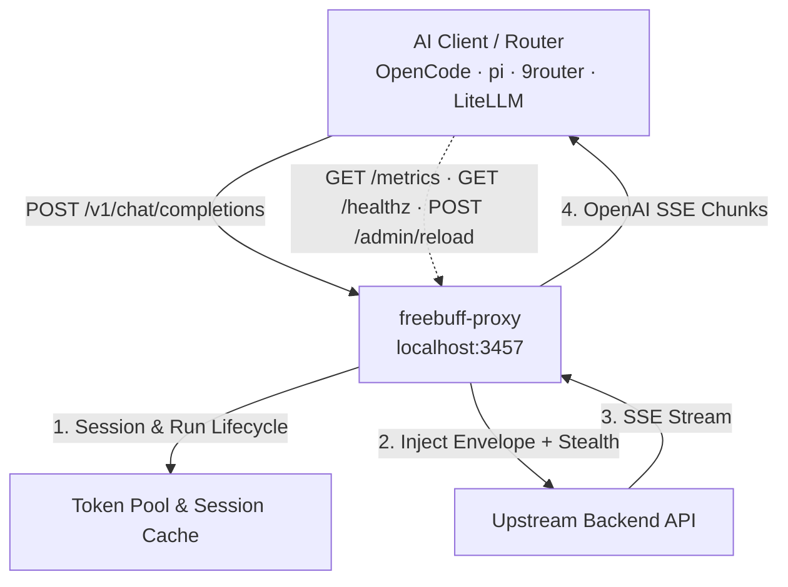

# freebuff-proxy: No ads, no CLI, just /v1/chat/completions

[](https://github.com/trefeon/freebuff-proxy/actions/workflows/ci.yml)
[](https://github.com/trefeon/freebuff-proxy/releases)
[](https://github.com/trefeon/freebuff-proxy/blob/main/LICENSE)

`freebuff-proxy` is a local gateway that makes the AI coding models behind Codebuff/FreeBuff available to **any** tool that speaks the OpenAI API: OpenCode, pi, 9router, LiteLLM, or your own scripts.

Your coding tools expect an OpenAI-style endpoint (`/v1/chat/completions`). The upstream service is not OpenAI-shaped: it is a CLI coding agent with its own session protocol, and its free-tier access is tied to per-account tokens that carry individual daily quotas and can be rate-limited or banned. `freebuff-proxy` sits between the two and absorbs that friction:

- **Translates**: rewrites standard OpenAI requests into the upstream session protocol (CLI request envelope, model-bound agent runs, tool-schema normalization) and streams the SSE response back as OpenAI `chat.completion.chunk` events.
- **Pools**: routes requests across multiple tokens (hot-session-first with round-robin start and failover), so a busy client or router rides out per-account quotas instead of failing.
- **Stealths**: makes egress look like a real browser (TLS fingerprints, header sanitization, request jitter) so upstream abuse detection is less likely to flag your account (see the ToS warning below).

> **⚠️ Terms-of-service risk.** Using your FreeBuff token through this proxy conflicts with FreeBuff/Codebuff terms of service; upstream abuse detection can suspend or permanently ban accounts. Use `SAFE_MODE=true`, keep usage modest, and do not run unattended 24/7. See [Getting Started](docs/guides/getting-started.md).

> **⚠️ Honest expectations.** FreeBuff's servers are strict, and this proxy **reduces** ban risk; it does not eliminate it. Nothing here can guarantee your account is never flagged or banned. Upstream detection is documented in the open-source FreeBuff client: per-request IP scoring (VPN/proxy/Tor/hosting egress → limited tier or terminal `country_blocked`), per-account trust levels with sticky caps (third-party-client flag, shared signup network, shared mailbox), daily spend ceilings ($0.50/day for restricted cohorts), and mass sweeps against known farm shapes (6,699 of 7,129 disposable-email accounts were already banned when the blocklist was compiled). This project is a local adapter that exposes FreeBuff's models as an OpenAI-compatible API for other coding agents (OpenCode, pi, hermes, openclaw, or any client that supports a custom endpoint). Your auth tokens are handled automatically by the gateway, which reimplements the official CLI's wire protocol (~99% parity); it is not the official client, and upstream changes can break it until adapted. Keep usage modest and follow the hygiene rules below; further improvements to session handling and ban avoidance are planned.

---

## Table of Contents

- [New here? Start here](#new-here-start-here)
- [Requirements](#requirements)
- [Features](#features)
- [How It Works](#how-it-works)
- [Key Concepts](#key-concepts)
- [Quick Start](#quick-start)
- [Command-Line Interface](#command-line-interface)
- [Configuration Reference](#configuration-reference)
- [Deployment](#deployment)
- [Guides](#guides)
- [Contributing & Security](#contributing--security)
- [Contact & Support](#contact--support)
- [License](#license)

---

## New here? Start here (30-Second Quick Start)

Freebuff-proxy makes the free AI models behind the FreeBuff/Codebuff CLI available to any OpenAI-compatible tool (Cursor, VS Code Continue/Cline, OpenCode, pi, 9router, Chatbox, LibreChat).

If you are a beginner, you don't need to write code or compile anything:

1. **Download the pre-built Release**: Go to [**Releases**](https://github.com/trefeon/freebuff-proxy/releases) and download the ZIP for your OS (e.g. `freebuff-proxy_..._windows_amd64.zip`). *(Do not use the green "Code -> Download ZIP" button, which is raw source code)*.
2. **Extract & Double-Click**: Unzip the folder.
   - **Windows**: Double-click `start-proxy.cmd`.
   - **Linux / macOS**: Open terminal in the extracted folder and run `./start-proxy.sh`.
3. **Log in**: When prompted, press Enter to open your browser and sign in with your FreeBuff/GitHub account. Your token is saved automatically!
4. **Open Web Dashboard**: Open [**http://localhost:3457/admin**](http://localhost:3457/admin) in your browser to view your live status, test chat, and manage tokens visually.
5. **Connect your tool**: In Cursor, VS Code Continue/Cline, Chatbox, or OpenCode, set:
   - **Base URL**: `http://localhost:3457/v1`
   - **API Key**: `not-needed`
   - **Model**: `deepseek/deepseek-v4-flash` (full-tier only; limited-tier accounts are coerced to `mimo/mimo-v2.5`)
   *(See [Client Integration Guide](docs/guides/client-integration.md) for 1-click config snippets)*.

**Before you start, the rules (what you should / shouldn't do):**

| ✅ Do | ❌ Don't |
|---|---|
| Use **one key until it is rate-limited**; the pool drains it naturally | **Don't rotate many healthy keys**; it looks like account farming |
| Use a **normal residential connection** | **Don't use a VPN / proxy / Tor** (Cloudflare TCP-layer GeoIP + MaxMind/Spur ASN detection → restricted cohort or `country_blocked`) |
| Register with a **real email** (e.g. Gmail) | **Don't use temp-mail** (documented ban cohort: 6,699 of 7,129 accounts already banned) |
| Request **only models your tier/region offers** (default Flash) | **Don't request out-of-region models**: refused/downgraded and correlated with your IP's geo |
| Read a `429` as **quota, resets Pacific midnight** | **Don't confuse it with a ban**; only `403` `banned`/`country_blocked` is terminal |
| Expect **reduced** risk, not immunity | **Don't run unattended 24/7** or expect zero ban risk |
| Keep the pool **draining one key at a time** | **Don't hammer many tokens from one public IP** (`ip_capped`) |


**Access Tiers.** FreeBuff determines your access tier via Cloudflare TCP-layer GeoIP (not HTTP headers — spoofing is impossible). A residential IP in a Tier-1 country (US, UK, DE, JP, CA, etc.) gets `accessTier: "full"` with all models available. Non-Tier-1 country IPs get `accessTier: "limited"` and all model requests are coerced server-side to `mimo/mimo-v2.5`. VPN/datacenter IPs are flagged via MaxMind/Spur ASN detection (`ipPrivacySignals: ["vpn"]`) and placed in a restricted cohort ($0.50/day ceiling). Workarounds for limited-tier users: route through a Tailscale/WireGuard exit node in a Tier-1 country, set `HTTP_PROXY` to a residential proxy, or pool 4-5 tokens for 15-30 sessions/day. See [Getting Started](docs/guides/getting-started.md) for details.
Full detail in [Key Hygiene & Ban Avoidance](#key-hygiene--ban-avoidance).

For a guided walkthrough, read [Getting Started](docs/guides/getting-started.md) (5 minutes).

## Requirements

| Requirement | Details |
|---|---|
| **A FreeBuff/Codebuff account** | Free account at codebuff.com / freebuff.com. The proxy relays your account's token; each account has its own daily session quota. |
| **A token (`cb_...`)** | From the official CLI login or `scripts/gen-token.*`. See [Obtain an Auth Token](#2-obtain-an-auth-token). |
| **OS** | Linux, macOS, or Windows (amd64/arm64). Prebuilt release binaries; no Go toolchain needed. |
| **Docker** | Optional: only for the container deployment path (`docker compose up -d --build`). |
| **Network** | Outbound HTTPS to `codebuff.com` (configurable via `UPSTREAM_BASE_URL`); the proxy listens on loopback `127.0.0.1:3457` by default. |
| **Go 1.26+** | Only if building from source. |

---

## Features

- **OpenAI-Compatible API**: `POST /v1/chat/completions` (stream + non-stream), `POST /v1/responses`, `POST /v1/messages` (Anthropic shape) + `/v1/messages/count_tokens`, `POST /v1/embeddings` (unsupported → `400 unsupported_endpoint`), `GET /v1/models`, `GET /healthz`, Prometheus `GET /metrics`, and hot config reload via `POST /admin/reload`.
- **Admin Dashboard**: embedded single-binary web UI at `http://<host>:3457/admin`: a modern **Svelte 5 + Tailwind CSS v4** single-page application with self-hosted **Geist** typography. Features a live overview with a 1-click smoke test, runtime token management with an always-visible 3-mode pool controller (`Pooled`, `Hybrid`, `Bridge`), a real-time SSE Playground with collapsible reasoning inspection, a **Configuration Studio** with 1-click presets and interactive quick knobs, universal client setup cards with 5 extension snippets, in-memory log stream with filtering, and SVG metrics sparklines. Zero external CDN or runtime Node.js dependency.
- **Dynamic Reasoning Effort**: OpenAI `reasoning_effort` (`low`/`medium`/`high`/`max`) and Codex/Anthropic `reasoning.effort` are normalized and mapped to upstream reasoning engines.
- **Session & Run Lifecycle**: Upstream session handshakes, model-lock recovery (`DELETE` → re-`POST`), grace draining, and idle-run finishing, all automatic.
- **Token Pooling & Bridge Mode**: Hot-session-first pooling with round-robin start and failover across `AUTH_TOKENS`, or zero-storage relay when clients bring their own token. See [Key Concepts](#key-concepts).
- **Token Auto-Discovery**: With empty `AUTH_TOKENS`, credentials are read from the official CLI login files (`~/.config/manicode/credentials.json`, `~/.config/codebuff/credentials.json`). Disable with `AUTO_DISCOVER_TOKEN=false`.
- **TLS Stealth**: browser TLS fingerprinting via uTLS (Chrome, Firefox, Safari, Edge) plus sanitized request headers so upstream traffic reads as a browser client.
- **Subagent-Ready Concurrency**: Single-flight session refresh prevents race conditions during high-volume tool-calling loops.
- **Safe Mode**: On by default: anti-ban presets (TLS stealth, header sanitization, jitter, idle rotation).
- **Operational Tooling**: `-doctor` diagnostics (config, port, DNS/TLS, registry; zero-cost per-token validity probes run by default), `-test-token` (zero-cost probe on the first token, prints live quota, exit 0/1 for installers and scripts), `-setup` interactive client configuration, and a SHA-256-verified `-update` self-updater.
- **Quota Transparency**: Live per-model quota (from the upstream `rateLimitsByModel` admission payload) is surfaced in `GET /healthz` (per-token `quota` map) and `GET /metrics` (`freebuff_proxy_quota_recent` / `freebuff_proxy_quota_limit` gauges).

## How It Works

One chat request, end to end:

1. **Your tool calls the proxy.** It POSTs a standard OpenAI request to `http://127.0.0.1:3457/v1/chat/completions`, same shape it would send to any OpenAI-compatible endpoint.
2. **A token is chosen.** The proxy prefers the token that already holds a live session (hot-session-first), starting from a round-robin index and skipping tokens in cooldown or locked by a rate limit; in bridge mode it uses the token your client sent in its `Authorization` header.
3. **The request is translated.** The model id is resolved through the catalog to the upstream agent that runs it, the message list is sanitized and re-wrapped in the CLI request envelope, and OpenAI extras (`reasoning_effort`, tool schemas, etc.) are mapped to what upstream expects.
4. **It goes out stealthily.** The upstream call uses a browser-like TLS handshake and sanitized headers.
5. **The stream comes back translated.** The upstream SSE stream is converted into OpenAI `chat.completion.chunk` events and relayed to your client in real time.
6. **State is cleaned up.** When the request finishes, the run is drained; once a run or token ages out (rotation interval, idle timeout), it is rotated or finished so the next request starts clean. A token that hit a quota limit (`429`) is locked locally until its reset time. The proxy answers `429` + `Retry-After` itself, with no traffic sent upstream.

The translation layer reimplements the official CLI's wire protocol and session lifecycle, sourced from the open-source Freebuff client (Apache-2.0). It changes when the upstream changes. The translation lives in `internal/convert`, `internal/upstream`, `internal/stealth`, and `internal/registry`.



## Key Concepts

| Concept | What it means |
|---|---|
| **Token** | One FreeBuff/Codebuff account credential (`cb_...`). Each token has its own daily quota and can be rate-limited or banned independently. |
| **Session** | Per-token upstream admission state (handshake, model locks). The proxy maintains and reuses it so every request does not pay the handshake cost. |
| **Run** | One upstream agent execution for a model, shared across many requests. Runs start on first use, live for `ROTATION_INTERVAL` (default `6h`), then are rotated (fresh start, old one drained/finished) so no run accumulates suspiciously long-lived activity. Idle tokens get their runs finished too. |
| **Model** | A catalog entry addressed as `provider/model` (e.g. `deepseek/deepseek-v4-flash`). The registry serves `/v1/models` and maps each model to the upstream agent that runs it. |
| **Pooled mode** | You configure several tokens in `AUTH_TOKENS`. Requests stick to the token with a live session and fail over only when it is rate-limited or errors: a reactive drain, not aggressive rotation. Best for one user with several accounts who wants maximum uptime and quota headroom. |
| **Bridge mode** | You configure no tokens. Each client sends its own token as `Authorization: Bearer <token>`, and the proxy relays with it, caching per-client state (LRU, max 32). Best for a shared router (e.g. 9router) serving many users who each bring their own account. |
| **Hybrid mode** | You configure `HYBRID_MODE=true` with tokens in `AUTH_TOKENS`. Clients that send a `Bearer` token get bridge-style per-client relay; token-less requests are served from the pool. Best when some clients bring their own account while your own tooling uses the pool. |
| **Safe mode** | Default-on anti-ban presets: TLS stealth, proxy-header sanitization, request jitter, and idle rotation. See [Safe Mode](#safe-mode--zero-spam-quota-handling). |
| **Quota lock** | When a token hits its daily limit, the proxy parses the upstream `429` reset timestamp and refuses local requests for that token until reset, fast (`<1ms`), silent, and spam-free. |

---

## Quick Start

### 1. Install

**One-command installer (Linux/macOS):**

```bash
curl -sSL https://raw.githubusercontent.com/trefeon/freebuff-proxy/main/scripts/install-freebuff-proxy.sh | bash
```

**Windows (PowerShell):**

```powershell
irm https://raw.githubusercontent.com/trefeon/freebuff-proxy/main/scripts/install-freebuff-proxy.ps1 | iex
```

The bash installer prompts for an install method (easy, manual binary, Docker Compose, bridge mode); both installers mint/read your token and write `.env`.

**Alternatively**, run with Docker Compose:

```bash
cp .env.example .env   # then set AUTH_TOKENS
git fetch --tags 2>/dev/null || true
VERSION=$(git describe --tags 2>/dev/null || echo dev) docker compose up -d --build
```

**Or** download a release binary from [Releases](https://github.com/trefeon/freebuff-proxy/releases) (Linux/macOS/Windows × amd64/arm64), unzip it, right-click the extracted folder → **Open in Terminal**, and run `./start-proxy.sh` (Windows: `.\start-proxy.cmd`; the `.cmd` wrappers bypass the PowerShell execution policy). The bundled scripts also include a headless token generator (`gen-token.sh` / `gen-token.cmd`).

### 2. Obtain an Auth Token

Generate one headlessly (opens a browser OAuth login). Run with no flags for an interactive menu; the recommended default (Enter) appends the token to `.env`, auto-creating it from `.env.example` if missing:

**Windows (PowerShell / CMD):**

```powershell
.\scripts\gen-token.cmd            # menu; Enter = append to .env (auto-create)
```

**Linux / macOS (bash):**

```bash
./scripts/gen-token.sh             # menu; Enter = append to .env (auto-create)
```

`gen-token.*` also supports explicit modes that skip the menu: `--clipboard` / `-ToClipboard`, `--save` / `-Save` (store in the CLI credentials file), `--append` / `-Append` (add to `.env` `AUTH_TOKENS`), and `--env <path>` / `-EnvFile <path>`.

Alternatively, log in with the official CLI (`npm i -g freebuff && freebuff`): the proxy auto-discovers the token from its credentials file on startup.

### 3. Configure

Copy the example and set your token:

```bash
cp .env.example .env
# AUTH_TOKENS=cb_xxx        ← paste your token (comma-separate for pooling)
# SAFE_MODE=true            ← default (set false to disable)
```

Leave `AUTH_TOKENS=` empty for **bridge mode** (clients bring their own tokens). Not sure which to pick? One user with a few accounts → pooled mode; a shared router serving many users → bridge mode. See [Key Concepts](#key-concepts). `config.example.json` shows the common keys in JSON form, loaded with `-config`; the [Configuration Reference](#configuration-reference) below documents every key.

### 4. Run & Verify

```bash
./freebuff-proxy            # or: docker compose up -d
```

Check health and run diagnostics:

```bash
curl http://127.0.0.1:3457/healthz
./freebuff-proxy -doctor        # config, port, DNS/TLS, registry, plus zero-cost per-token validity probes
./freebuff-proxy -test-token    # zero-cost probe on the first token (no session claimed); prints live quota, exit 0/1
```

---

## Command-Line Interface

| Flag | Description |
|---|---|
| *(none)* | Run the proxy |
| `-config <path>` | Load an optional JSON config file (keys mirror env names) |
| `-v` | Verbose (debug) logging |
| `-version` | Print version and exit |
| `-doctor` | Run configuration and environment diagnostics: config, port, DNS/TLS reachability, model registry, plus a zero-cost validity probe per token |
| `-test-token` | Probe the first configured token with a zero-cost upstream GET probe (no session claimed); prints `token OK` and live quota, exits `0`, or exits `1` (for installers/scripts) |
| `-update` | Self-update from the latest GitHub release (SHA-256 verified against `checksums.txt`) |
| `-setup` | Interactive client setup (detects installed clients) |
| `-yes` | Auto-confirm `-setup` prompts |
| `-refresh-token N` | Re-authenticate token #N in `.env` via the headless GitHub login flow and exit. Interactive: prints a login URL and polls. With `-yes` and `GITHUB_USER` / `GITHUB_PASSWORD` / `GITHUB_TOTP` set: protocol login |
| `-install-service` | Register the current binary as a background service and start it: Task Scheduler on Windows (per-user, no admin), systemd `--user` unit on Linux, launchd LaunchAgent on macOS. Runs from the executable's directory so `.env` resolves, and auto-starts on logon/boot |
| `-uninstall-service` | Stop and unregister the background service (idempotent) |
| `-service-status` | Check whether the service is registered and running; exits `0` when registered, `1` when not (scriptable) |

---

## Configuration Reference

All keys can be set via environment variables or the JSON config file passed to `-config` (`AUTO_DISCOVER_TOKEN` is environment-only); a local `.env` file (if present) is also read, and for the keys it covers it behaves like the environment. Precedence, lowest to highest: **built-in defaults < JSON `-config` < `./.env` < environment**. List values (`AUTH_TOKENS`, `API_KEYS`, `MODELS_ALLOW`) are comma-separated in env and arrays in JSON (`MODELS_ALLOW` also accepts a plain comma-separated JSON string).

| Environment Variable | Default | Description |
|---|---|---|
| `LISTEN_ADDR` | `127.0.0.1:3457` | Host and port to bind (loopback; containers set `:3457`) |
| `UPSTREAM_BASE_URL` | `https://codebuff.com` | Upstream API endpoint (normalized to `www.codebuff.com`) |
| `AUTH_TOKENS` | `""` | Comma-separated upstream tokens (empty = bridge mode) |
| `HYBRID_MODE` | `false` | Run the pooled pool and bridge relay in one process: a client `Authorization: Bearer` token is relayed like bridge, token-less requests fall back to `AUTH_TOKENS` (pooled requests still require an `API_KEYS` match when `API_KEYS` is set) |
| `MODELS_HIDE_UNAVAILABLE` | `false` | `/v1/models` prunes models marked unavailable (region/tier demotion, quota exhaustion) so picker clients cannot select them; off by default so a stale signal never hides a working model |
| `MODELS_ALLOW` | `""` | Comma-separated model allowlist (JSON array or string). When set, only these RESOLVED model ids are served — `/v1/models` lists only them, and `chat/messages/responses` requests whose resolved model (after alias resolution and `-max` upgrades) is not listed are rejected with `404 model_not_found` (`"model not allowed by MODELS_ALLOW"`). With `PREFER_MAX_MODELS=true` an allowlisted **base** id (e.g. `deepseek/deepseek-v4-flash`) also accepts its `-max` variant — clients keep requesting the base id, the proxy serves the extended-context variant. Empty = all models allowed |
| `AUTO_DISCOVER_TOKEN` | `true` | When `AUTH_TOKENS` is empty, read credentials from the official CLI login files (`false` disables) |
| `API_KEYS` | `""` | Comma-separated client keys required for `/v1/*` (empty = open; ignored in bridge mode) |
| `ADMIN_TOKEN` | `""` | Bearer token that `POST /admin/reload` requires when set (empty = unauthenticated in default deployments; a startup warning is logged). Also the login password for the [admin dashboard](#admin-dashboard): the same value unlocks the login page |
| `ROTATION_INTERVAL` | `6h` | Agent-run rotation interval |
| `REQUEST_TIMEOUT` | `15m` | Upstream request timeout |
| `SESSION_CALL_TIMEOUT` | `30s` | Session call timeout |
| `REGISTRY_REFRESH` | `6h` | Model catalog refresh interval |
| `COST_MODE` | `free` | `free` (free-tier) or paid billing mode |
| `ACTING_USER_ID` | `""` | Optional FreeBuff account id; sent on every chat call as `x-freebuff-acting-user-id`. BAN RISK: only the token's own account id is safe (the CLI derives it from `GET /api/v1/me`; the server honors the header only for the FreeBuff Web service account) — any other value impersonates another user. Pre-rename name `USER_ID` still works. Empty = header omitted |
| `TLS_FINGERPRINT` | `auto` | `auto`, `chrome120`, `chrome126`, `safari17`, `safari18`, `firefox120`, `firefox128`, `edge126`, `random` |
| `DEBUG_DUMP` | `false` | Persist redacted traffic dumps to `./dump/` (mode 0600) |
| `LOG_FILE` | `""` | Append log lines to a file (e.g. `./logs/proxy.log`) |
| `LOG_LEVEL` | `info` | `debug`, `info`, `warn`, `error`, `trace` (trace = wire-level bodies) |
| `LOG_FORMAT` | `text` | `text` (key=value, colored) or `json` (one JSON object per line) |
| `LOG_ACCESS` | `true` | Log one `access` line per HTTP request (`false` disables; `/healthz`, `/metrics`, OPTIONS are rate-limited to 1/min regardless) |
| `LOG_RING_SIZE` | `500` | In-memory log ring for `/admin/logs` (50–5000) |
| `MAX_MESSAGES_PER_DAY` | `0` | Per-token daily cap on successful chats (`0` = unlimited, default; the upstream `429` lock is the real enforcement) |
| `IDLE_ROTATION_TIMEOUT` | `0` | Finish runs after this idle period (`0` = disabled; `SAFE_MODE` sets 30m when unset) |
| `SAFE_MODE` | `true` | Apply anti-ban presets (see below; set `false` to disable) |
| `REQUEST_JITTER` | `0s` | Random delay range `[0, REQUEST_JITTER)` before upstream calls (`SAFE_MODE` sets 2s when unset) |
| `CLI_VERSION` | `0.10.7` | Upstream CLI version string used in the request envelope |
| `MODEL_ALIASES` | `""` | Map aliases to real model IDs, e.g. `gpt-4o:deepseek/deepseek-v4-pro`. When unset, built-in aliases apply: `deepseek-chat` → `deepseek/deepseek-v4-flash`, `gpt-4o` → `deepseek/deepseek-v4-pro`, `claude-3-5-sonnet` → `anthropic/claude-fable-5`. An explicit value (even empty) suppresses all defaults |
| `TRANSIENT_RETRIES` | `1` | Max additional attempts after a transient transport failure; `0` disables |
| `SESSION_PERSIST` | `false` | Persist session state AND active agent runs to disk so a restart resumes them instead of re-creating (new daily slot / re-START) |
| `SESSION_STATE_FILE` | `.freebuff-session-state.json` | Path of the session state file (used when `SESSION_PERSIST=true`; token-keyed, `0600`) |
| `SESSION_RE_ADMIT_LEAD` | `60s` | Re-admit a session pre-emptively when less than this remains: the request rides the old session while the refresh runs in the background |
| `SESSION_PROBE_CACHE_TTL` | `15s` | Reuse the last successful session state (skip redundant session poll GETs) within this window |
| `SESSION_CREATE_MAX_PARALLEL_GLOBAL` | `128` | Cap on concurrent in-flight session admissions (wait-or-503) |
| `SESSION_CREATE_MAX_PARALLEL_PER_MODEL` | `32` | Per-model cap on concurrent in-flight session admissions |
| `RUN_FINISH_QUEUE_SIZE` | `64` | Bounded deferred-FINISH worker queue for rotated/drained runs |
| `RUN_FINISH_INLINE_TIMEOUT` | `250ms` | Synchronous inline FINISH fallback bound when the finish queue is full |
| `RUNS_DRAIN_QUEUE_CAP` | `64` | Draining-runs list cap; older entries are force-dropped (FINISH is best-effort) |
| `RUNS_DRAIN_TTL` | `10m` | Draining-runs TTL eviction window |
| `HTTP2_UPSTREAM` | `true` | Negotiate HTTP/2 with the upstream so the ALPN matches real browsers; `false` forces HTTP/1.1 |
| `FALLBACK_MODEL` | `""` | Model to use once the requested premium model's queue wait passes `FALLBACK_AFTER_MS` |
| `FALLBACK_AFTER_MS` | `10000` | Queue-wait threshold (ms) before falling back to `FALLBACK_MODEL` |
| `CORS_ALLOWED_ORIGIN` | `*` | `Access-Control-Allow-Origin` for `/v1/*` responses |
| `ADOPT_CLI_SESSION` | `false` | Adopt the upstream CLI's active session instead of creating a new one |
| `WAITING_ROOM_CHAIN` | `false` | Chain queued waiting-room requests across tokens instead of erroring |
| `WEBHOOK_URL` | `""` | Notify this URL when a run finishes (POST) |
| `RATE_LIMIT_PER_IP` | `0` | Requests/second allowed per client IP (`0` = disabled; e.g. `20`) |
| `RATE_LIMIT_BURST` | `0` | Burst request capacity per client IP (`0` = default `2 * RATE_LIMIT_PER_IP`) |

When `SESSION_PERSIST=true`, the state file stores a SHA-256 hash of each
active token plus its session metadata (instance id, expiry, tier/country)
**and its active agent runs** (run id, agent, trace session id), including
bridge-mode client tokens, since every session manager shares the one store.
A restart adopts the persisted session and runs without re-creating them.
The raw token is never written, and the file is created with mode
`0600`. Leave `SESSION_PERSIST` unset (or `false`) to opt out entirely.

### Safe Mode & Zero-Spam Quota Handling

`SAFE_MODE=true` is the **default** for all setups (set `SAFE_MODE=false` to
opt out). It enables essential anti-ban protections and presets:

- **JA3 TLS Stealth**: Mimics real browser handshakes (Chrome 120/126, Safari 17/18, Firefox 120/128, Edge 126) via `uTLS` to prevent WAF / CDN bot detection.
- **Proxy Header Sanitization**: Strips 25 proxy-identifying headers (`X-Forwarded-For`, `Via`, `CF-Connecting-IP`, etc.).
- **Request Jitter**: Injects randomized 0-2s delay jitter to break robotic, machine-like cadence.
- **Idle Rotation**: Finishes runs after 30 minutes of inactivity.
- **Daily Cap** (optional): `MAX_MESSAGES_PER_DAY` defaults to `0` (unlimited). The upstream `429` lock is the real enforcement; see below.

### Key Hygiene & Ban Avoidance

- **Use one key until it is rate-limited.** The pool prefers the token that already holds a
  live session (hot-session-first) and only fails over when a token hits its quota or errors.
  It does **not** aggressively round-robin healthy keys. Letting one account run until its
  daily quota is natural usage; rotating many healthy keys in rapid succession looks like
  account farming and can trigger upstream ban detection.
- **Do not route through a VPN.** FreeBuff resolves access tier via Cloudflare TCP-layer GeoIP
  (not HTTP headers — `X-Forwarded-For`/`CF-Connecting-IP` spoofing is impossible at L4).
  VPN/datacenter IPs are detected via MaxMind/Spur Intelligence ASN databases
  (`ipPrivacySignals: ["vpn"]`) and placed in a restricted cohort with a **$0.50/day spend ceiling**.
  Commercial VPNs (NordVPN, ExpressVPN), datacenter VPS (AWS, DO, Hetzner), and Tor all trigger
  this detection. The proxy's stealth settings mask TLS fingerprints and proxy headers; they do
  **not** change your public IP. Use a normal residential connection.
- **Do not hammer many tokens at once from the same public IP.** Upstream caps how many
  distinct users can hold an active free session on one egress IP (`ip_capped`, 429), and
  accounts created from the same signup network (≥8 per /24) or mailbox (≥3) are permanently
  capped at lower trust levels. Documented ban cohorts include single-IP rings and same-day
  account mints. The pool already drains keys one at a time; do not add aggressive rotation
  on top.
- **Only request models your account's tier and region actually offers.** Out-of-tier picks
  are refused or downgraded (`model_unavailable`, `session_model_mismatch`).
  The requested model id is correlated with the egress IP's resolved geo, so a premium model request
  from a VPN/hosting IP is a suspicious, ToS-prohibited combination. On limited-tier accounts,
  `mimo/mimo-v2.5` is the supported active model (`deepseek/deepseek-v4-flash` is restricted on limited tier).
- **Know the difference between a quota and a ban.** `429` (quota, resets at
  Pacific midnight) is the normal end-of-day signal; the proxy locks the token locally and
  answers in `<1ms`, and routers fail over. `503` with `waiting_room` is the queued-waiting-room
  signal (also transient). Only `403` with `banned` / `country_blocked`
  means the account itself is gone: stop using it and move to a fresh established account.
- **For ~24h of continuous coding, budget 4-5 keys.** Each FreeBuff account has a concurrent
  session quota (up to 5 concurrent sessions on premium tier, 3 on limited tier).
  One key ≈ one day of moderate use. Configure `AUTH_TOKENS` with multiple tokens to pool session
  headroom across tokens and let the proxy drain them one at a time.
- **Register accounts with real email addresses** (e.g. Gmail). Disposable / temp-mail
  registrations are a documented ban cohort: 6,699 of 7,129 accounts on flagged domains were
  already banned when the blocklist was compiled. Accounts sharing one mailbox are capped at
  lower trust levels.

**Why `MAX_MESSAGES_PER_DAY` Defaults to `0` (Unlimited):**

- Unlimited is the **default**: no local cap throttles your free-tier allowance.
  The proxy never spams upstream: when an account reaches its daily quota, the
  upstream `429` lock kicks in (below), so an unlimited local cap is safe.
- **Zero-Spam Guarantee**: When an account reaches its daily quota or upstream capacity limit, the upstream returns a `429` with a Pacific midnight reset timestamp (`resetAt: 07:00:00Z`).
- The proxy parses this timestamp and **locks the token locally in memory**.
- Any subsequent request for that token returns `429` locally in `<1ms` without sending any network traffic upstream.
- Upstream routers (e.g. 9router) receive standard `429` + `Retry-After` headers and automatically rotate to your next available account without failing user prompts.

### HTTP Endpoints

| Endpoint | Auth | Description |
|---|---|---|
| `POST /v1/chat/completions` | `API_KEYS` (when set) | OpenAI-compatible chat, streaming and non-streaming |
| `GET /v1/models` | `API_KEYS` (when set) | Model catalog from the registry (fallback at boot + live refresh). Each row carries `available`/`status`/`current_access_tier`: models outside the limited-tier allowlist (`mimo-v2.5`) are marked `available:false, status:"region_limited"` when the token's egress region demotes it to the limited tier; `MODELS_HIDE_UNAVAILABLE=true` prunes them from the list; `MODELS_ALLOW` prunes every id not in the allowlist |
| `GET /healthz` | none | JSON: `status`, `uptime_seconds`, `models`, per-token snapshot (incl. per-model `quota` map when the last admission carried it), `bridge_tokens` |
| `GET /metrics` | none | Prometheus text format: uptime, model count, per-token 24h messages / requests / active runs / cooldown, per-model quota (`freebuff_proxy_quota_recent` / `freebuff_proxy_quota_limit`) |
| `POST /admin/reload` | `ADMIN_TOKEN` (when set) | Hot-reload configuration from disk without restart |
| `GET /admin` | session cookie (login via `ADMIN_TOKEN`) | Admin dashboard: overview, tokens, config, logs, metrics (see [Admin Dashboard](#admin-dashboard)) |
| `GET/POST /admin/login` | none | Dashboard login: constant-time `ADMIN_TOKEN` check, per-IP rate limit, `HttpOnly` + `SameSite=Strict` session cookie |
| `POST /admin/config` | session cookie | Validate and persist the `.env` file, then hot-reload the config (rolls back on rejection) |
| `POST /admin/smoke` | session cookie (loopback when `ADMIN_TOKEN` unset) | One real chat through the pool: reports model, token, latency, and a content preview (bridge mode needs a client token in the payload) |
| `POST /admin/diag` | session cookie (loopback when `ADMIN_TOKEN` unset) | Dashboard diagnostics (same checks as `-doctor`): config state, DNS + TCP reachability, registry count; zero-cost per-token validity probes run on every request |
| `POST /admin/mode` | session cookie (loopback when `ADMIN_TOKEN` unset) | Runtime pooled↔bridge↔hybrid switch; `{"mode":"bridge"}` empties the pool and clears `AUTH_TOKENS` in `.env`, `{"mode":"hybrid"}` enables per-client relay alongside the pool |
| `POST /admin/tokens/...` | session cookie (loopback when `ADMIN_TOKEN` unset) | Runtime pool management: `/add`, `/remove` (last token), `/test-all`, and per-token `/test`, `/unlock`, `/finish`, persisted to `.env` |

## Admin Dashboard

The proxy ships with a built-in modern SPA web dashboard: single binary, no external dependencies, and zero runtime Node.js requirement (the Svelte 5 production build is compiled and embedded into the binary at build time). Open `http://127.0.0.1:3457/admin` (or your `LISTEN_ADDR`).

- **Login**: enter your `ADMIN_TOKEN` on the login page. It is the same value as the bearer token for `POST /admin/reload`. Without `ADMIN_TOKEN` the dashboard is open (matching `/admin/reload`'s legacy behavior; a startup warning is logged). Failed logins are rate-limited per IP (5 fails → 1 minute lockout), and the session cookie is `HttpOnly` + `SameSite=Strict` (+ `Secure` when TLS or `X-Forwarded-Proto: https` is present).
- **Overview**: live relay state (pooled/hybrid/bridge mode, model count, uptime, safe mode) with per-token cards: session status, risk score, usage vs `MAX_MESSAGES_PER_DAY`, transient-retry counters, plus a **smoke test** that sends one real chat through the pool (status, latency, preview).
- **Tokens & Quotas**: per-token session detail + live per-model session quota table with usage bars and reset times; per-token **Unlock** (clears cooldown/ban), **Finish runs**, and **Test** (zero-cost validity probe). Features an **always-visible 3-mode pool switcher** (`Pooled`, `Hybrid`, `Bridge`), runtime **Add Token to Pool** form, and **Test all**, with changes automatically persisted to `.env`.
- **Models**: live catalog with upstream agent mappings, default model badges, and `MODEL_ALIASES`.
- **Traces**: recent chat requests and their routing outcome (token, model, status, duration, error class), the observability view for ban-avoidance debugging.
- **Playground**: interactive prompt console with real-time SSE chat streaming, model selector, and collapsible thinking/reasoning blocks.
- **Configuration Studio**: hot-reloading `.env` editor equipped with **4 One-Click Presets** (*Stealth Anti-Ban*, *Maximum Speed*, *Deep Debugging*, *Hybrid Relay*), **interactive quick knobs** (boolean switches, enum pills, duration sliders) with real-time bidirectional sync, and **hover quick info cards** explaining every setting and default.
- **Setup & Tool Integration**: universal 1-click copy cards (Base URL, API Key, Default Model), copy-paste snippets for 5 major AI coding tools (OpenCode, Continue/Cline, aider, 9router, cURL), headless OAuth login wizard, and diagnostic suite.
- **Logs**: real-time in-memory log stream with level filtering (`INFO`, `DEBUG`, `WARN`, `ERROR`), search filtering, and structured field tags.
- **Metrics**: tabular stat cards with SVG sparklines and direct link to the raw `/metrics` Prometheus feed.

See [Dashboard Guide](docs/guides/dashboard.md) for access, Docker caveats, and hardening.

---

## Deployment

- **Docker**: `docker-compose.yml` + `Dockerfile`, runs as an unprivileged user, healthchecked on `/healthz`, `LISTEN_ADDR=:3457` inside the container.
- **Systemd**: `scripts/freebuff-proxy.service` (Linux).
- **macOS launchd**: `scripts/com.freebuff-proxy.plist` (macOS).
- **Docker + 9router helper**: `scripts/setup-proxy-docker.sh`.

## Guides

- [Getting Started](docs/guides/getting-started.md): 5-minute setup walkthrough
- [Client Integration](docs/guides/client-integration.md): OpenCode, pi, 9router, LiteLLM, OpenAI SDKs
- [9router Integration](docs/guides/9router-integration.md): router dashboard setup in bridge mode
- [Dashboard Guide](docs/guides/dashboard.md): the admin web UI: access, pages, Docker caveats, hardening
- [Manual Testing](docs/guides/testing.md): verify the proxy on Linux or Windows by hand, step by step
- [Version Stability & Ban Findings](docs/guides/version-stability-and-ban-findings.md): **read before upgrading** — why v0.11.2 bridge is the proven-stable deployment and how `PREFER_MAX_MODELS` on newer versions caused instant account bans

---

## Contributing & Security

- [Contributing](CONTRIBUTING.md): filing issues, opening PRs, what to expect
- [Security](.github/SECURITY.md): supported versions and how to report a vulnerability

## Contact & Support

- **Questions, bugs, feature requests**: [GitHub Issues](https://github.com/trefeon/freebuff-proxy/issues)
- **Security reports**: [SECURITY.md](.github/SECURITY.md)
- **Contributing**: [CONTRIBUTING.md](CONTRIBUTING.md)

## License

[MIT](LICENSE)
